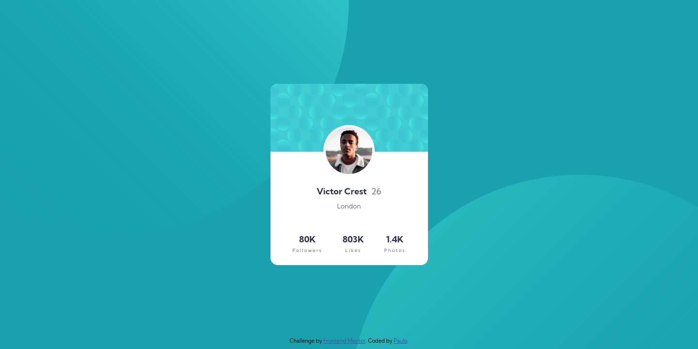

# Frontend Mentor - Profile card component solution

This is a solution to the [Profile card component challenge on Frontend Mentor](https://www.frontendmentor.io/challenges/profile-card-component-cfArpWshJ). 

## Table of contents

- [Overview](#overview)
  - [The challenge](#the-challenge)
  - [Screenshot](#screenshot)
  - [Links](#links)
- [My process](#my-process)
  - [Built with](#built-with)
- [Author](#author)

## Overview

### The challenge

- Build out the project to the designs provided

### Screenshots

### Links

- Solution URL: [https://www.frontendmentor.io/solutions/profile-card-component-semantic-html-css-with-flexbox-BkK63I1S9](https://www.frontendmentor.io/solutions/profile-card-component-semantic-html-css-with-flexbox-BkK63I1S9)
- Live Site URL: [https://profile-card-component-wellspr.vercel.app/](https://profile-card-component-wellspr.vercel.app/)

## My process

### Built with

- Semantic HTML5 markup
- CSS
- Flexbox
- Mobile-first workflow

## Author

- Frontend Mentor - [@wellspr](https://www.frontendmentor.io/profile/wellspr)
- Twitter - [@paulo_wells](https://www.twitter.com/paulo_wells)
